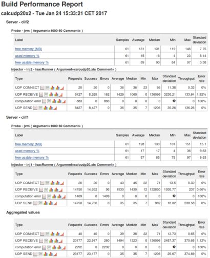
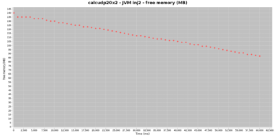
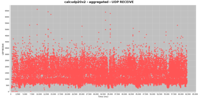
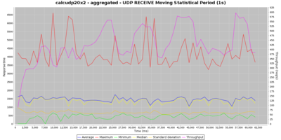
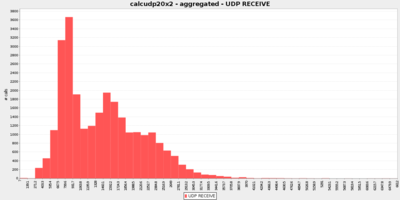
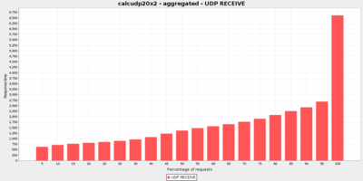
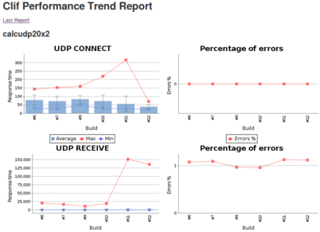

clif-performance-testing
========================

Run your performance tests defined with
[CLIF](http://clif.ow2.org/) from Jenkins, and get a variety of
automatically generated performance reports and charts.

Useful for: automated performance testing, performance testing in
continuous integration, providing a simple web user interface for CLIF,
monitoring QoS or applications QoE and possibly send alerts in case of
bad responsiveness.

[](https://clif.ow2.io/)

[CLIF](http://clif.ow2.org) is an open (source), extendible performance
testing software supporting a variety of load injection protocols: TCP,
UDP, HTTP(S), FTP, DNS, LDAP(S), SIP, RTP, GIT, SVN, JDBC, JMS...  
CLIF also embeds a probe framework to monitor arbitrary resources
available on the network (via SNMP, JMX...) or on computing nodes (CPU,
RAM, disks, network...)

CLIF comes with a variety of integrations and user interfaces:
command-line, simple standalone GUI, full-fledged GUI integrated to
Eclipse, Maven plug-in and... Jenkins plug-in.

Thanks to this plug-in, you can import CLIF test projects (bundled
scenarios, test plans and test data sets), typically written using
CLIF's main GUI, as Jenkins jobs. Then, a detailed [performance
report](docs/images/BuildPerformanceReport.png)
is generated for each test run, including a global statistical analysis
as well as graphs ([scatter
chart](docs/images/callChart.png),
[moving
statistics](docs/images/movingStatChart.png),
[histograms](docs/images/fixedSliceNumberDistributionChart.png)
and
[quantiles](docs/images/quantileDistributionChart.png)
distribution analysis) about load injectors' responses times and
throughput. The CLIF performance report also provides statistics and
[charts about probes
measurements](docs/images/JVMusage.png).  
A [performance trend
chart](docs/images/PerformanceTrendReport.png)
is also maintained through test executions.

## Changelog

#### v1.0.2

- FIX: compatibility with Jenkins 2.198+ (some CLIF reports failing to be generated)

#### v1.0.1

- FIX: missing icons and help sections
- IMPROVEMENT: removed useless dependency with ant plug-in

## Installation

#### Installing a CLIF runtime

Prior to running or importing any CLIF test plans, you need to install
at least one CLIF runtime, typically a 2.3.7+ "CLIF server"
distribution, available for download from
[here](https://clif.ow2.io/download/).

Once you have unzipped this CLIF distribution, make sure you have a Java
8+ execution environment installed.

To check your CLIF installation, run this command line:

- Windows (with cmd.exe):
```
C:\> C:\path\to\clif-2.3.3-server\bin\clifcmd version
Caption=Microsoft Windows 7 Enterprise
OSArchitecture=64-bit
Name=Intel(R) Core(TM) i7-5600U CPU @ 2.60GHz
java version "1.8.0_121"
Java(TM) SE Runtime Environment (build 1.8.0_121-b13)
Java HotSpot(TM) 64-Bit Server VM (build 25.121-b13, mixed mode)
clif 2.3.8 compiled 2020-Jan-13, 08:56 GMT+0000 by root
```
- Linux:
```
$ /path/to/clif-2.3.3-server/bin/clifcmd version
Linux 4.15.0-76-generic #86~16.04.1-Ubuntu SMP Mon Jan 20 11:02:50 UTC 2020 x86_64
openjdk version "1.8.0_242"
OpenJDK Runtime Environment (build 1.8.0_242-8u242-b08-0ubuntu3~16.04-b08)
OpenJDK 64-Bit Server VM (build 25.242-b08, mixed mode)
clif 2.3.8 compiled 2020-Jan-13, 08:56 GMT+0000 by root
```
In case Java can't be found, or the default Java environment is not
appropriate, change your PATH environment variable so that the bin
directory of the right Java runtime is found first.

#### Adding a CLIF runtime to Jenkins tools

Once the CLIF Performance Testing plug-in is installed in Jenkins, you
can add the installed CLIF runtime to the Jenkins tools configuration
page (Manage Jenkins\>Global Tool Configuration).

Go to the Clif section, click on button **Clif installations...** and
fill the fields:

-   name (say, "CLIF 2.3.8")
-   home directory (CLIF runtime's root directory, say
    "/path/to/clif-2.3.8-server")
-   enter specific Java options to be set in CLIF's Java Virtual
    Machines running the tests (optional)
-   Notes:
    -   don't care about checkbox "Install automatically" (not
        implemented yet)
    -   checkbox "Run with ProActive Scheduler?" is documented in [this
        page](https://wiki.jenkins.io/display/JENKINS/CLIF+Performance+Testing+Plugin+with+ProActive)

Click on **Save** or **Apply** buttons at the page bottom.

Note: you may declare as many CLIF runtimes as you need, including
several instances of the same runtime (same CLIF home directory) but
with different names and Java properties.

## Creating a CLIF job

The CLIF Performance Testing plug-in provides two ways of creating a
CLIF test job:

-   either from a source code management system, as usual for Jenkins
    job;
-   or by using the CLIF import wizard provided by the plug-in and available
    in Jenkins' main menu.

#### Via Source Code Management

As mentioned at the top of this page, CLIF's main GUI is based on
Eclipse. CLIF scenarios, test plans and possible data sets are grouped
together in a CLIF project. It is straightforward to use a Source Code
Management (Git, Svn...) client provided by Eclipse to push this
project to an SCM repository.

Once your CLIF project is available on an SCM repository, create a new
Freestyle project (`New Item... > Freestyle Project`). Go to the Source
Code Management section and provide all necessary details about your
project repository.

Then, go to the Build section, and add an **Invoke Clif** build step:

-   choose your CLIF runtime, as previously configured in Jenkins tools
-   enter your CLIF test plan file name - this file must be provided by
    the CLIF project that will be checked-out from the specified SCM
    repository
-   click on **Save** or **Apply** button

Finally, you may be interested in adding a post-build action to
automatically generate on each CLIF job successful completion. Refer to
section below dedicated to [CLIF reports
configuration](#clif-reports-configuration).

#### Via the Import wizard

Another convenient way to proceed is to export the CLIF project as a zip
archive from CLIF's Eclipse-based main GUI, and then to import it from
Jenkins using wizard **Import a Clif zip**.

Once you have selected your CLIF project's zip file (beware of automatic
refresh that tends to discard your file selection), the wizard makes you
choose the CLIF runtime for the new job(s), as well as the test plans to
import. One job will be created per imported test plan. However, note
that all these jobs will share a common workspace, that will become
visible as soon as you run the created jobs.

Click on **Validate** button.

Note: the import wizard also adds a Publish Clif performance report
post-build action. Refer to next section to configure CLIF reports.

## CLIF Reports Configuration</a>

To get a performance report automatically generated on each successful CLIF job run, just add post-build action Publish CLIF performance report to the Post-build Actions section.  
You shall keep the default value for parameter Clif report directory, unless you changed it for some reason in the advanced settings of the Invoke Clif build action.

CLIF performance reports give for each job execution:

- for each load injector, as well as for all load injectors combined:
  * an array of response times statistics for each request type, as well as average throughput and total number of errors
  * a collection of graphs about response times and throughput: scatter graph, moving statistics, distribution (histograms and quantiles)
- for each probe:
  * an array of statistics about each monitored value
  * a scatter graph for each monitored value
- for all probes and load injectors: an array of alarms 

[](docs/images/BuildPerformanceReport.png)
[](docs/images/JVMusage.png)
[](docs/images/callChart.png)
[](docs/images/movingStatChart.png)
[](docs/images/fixedSliceNumberDistributionChart.png)
[](docs/images/quantileDistributionChart.png)

With the **Advanced** settings of *Publish Clif performance report*
post-build action, you may set:

-   aliases to requests, that make it possible to aggregate requests
    that would be considered of different types otherwise, as well as to
    get arbitrary request names in the report
-   request success characterization, to override the test scenarios'
    success and failure specification
-   a time sub-interval (to discard initial and/or final test phases)
-   measurements statistical cleaning (to discard outstanding values)
-   charts parameters (charts size, number or size of distributions
    categories, moving statistics time-window)

Beyond the detailed CLIF performance report generated for each CLIF job
successful run, a Clif performance Trend report is also maintained to
see the response time and error trends for each request type.  
[](docs/images/PerformanceTrendReport.png)